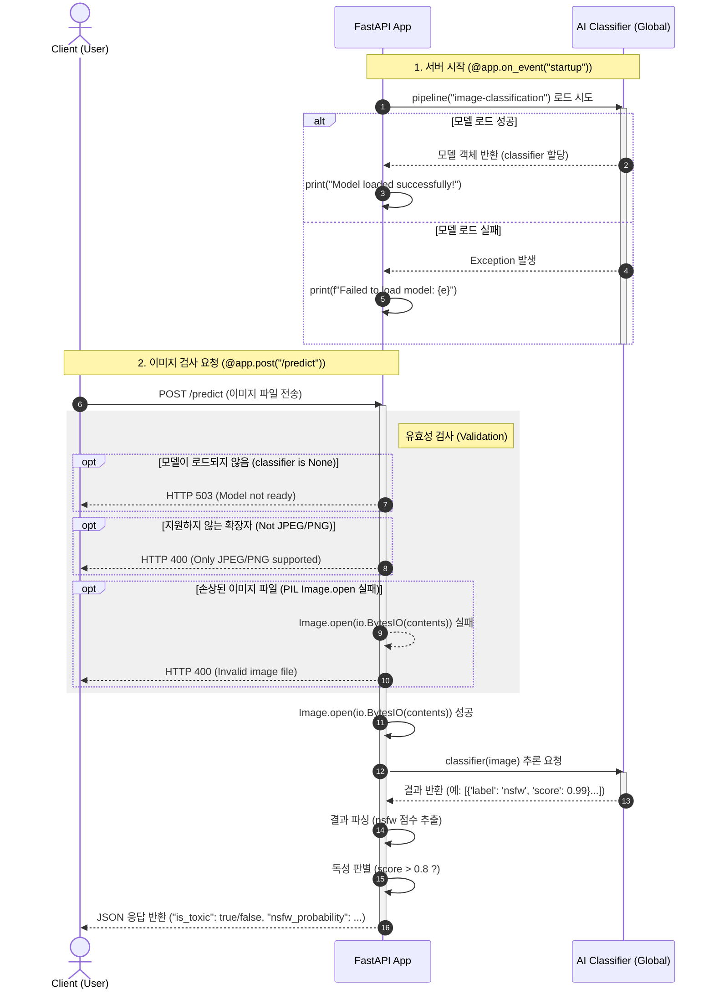

```mermaid
sequenceDiagram
    autonumber
    actor Client as Client (User)
    participant API as FastAPI App
    participant Model as AI Classifier (Global)

    %% 1. 서버 시작 시점 (Startup Event)
    note over API, Model: 1. 서버 시작 (@app.on_event("startup"))
    API->>Model: pipeline("image-classification") 로드 시도
    activate Model
    
    alt 모델 로드 성공
        Model-->>API: 모델 객체 반환 (classifier 할당)
        API->>API: print("Model loaded successfully!")
    else 모델 로드 실패
        Model-->>API: Exception 발생
        API->>API: print(f"Failed to load model: {e}")
    end
    deactivate Model

    %% 2. 클라이언트 요청 시점 (Predict Endpoint)
    note over Client, API: 2. 이미지 검사 요청 (@app.post("/predict"))
    Client->>API: POST /predict (이미지 파일 전송)
    activate API

    %% 3. 예외 처리 및 유효성 검사 구역
    rect rgb(240, 240, 240)
        note right of API: 유효성 검사 (Validation)
        
        opt 모델이 로드되지 않음 (classifier is None)
            API-->>Client: HTTP 503 (Model not ready)
            
        end

        opt 지원하지 않는 확장자 (Not JPEG/PNG)
            API-->>Client: HTTP 400 (Only JPEG/PNG supported)
            
        end

        opt 손상된 이미지 파일 (PIL Image.open 실패)
            API-->>API: Image.open(io.BytesIO(contents)) 실패
            API-->>Client: HTTP 400 (Invalid image file)
            
        end
    end

    %% 4. 정상 처리 로직
    API->>API: Image.open(io.BytesIO(contents)) 성공
    
    API->>Model: classifier(image) 추론 요청
    activate Model
    Model-->>API: 결과 반환 (예: [{'label': 'nsfw', 'score': 0.99}...])
    deactivate Model

    %% 5. 결과 처리 로직
    API->>API: 결과 파싱 (nsfw 점수 추출)
    API->>API: 독성 판별 (score > 0.8 ?)
    
    API-->>Client: JSON 응답 반환 ("is_toxic": true/false, "nsfw_probability": ...)
    deactivate API
```